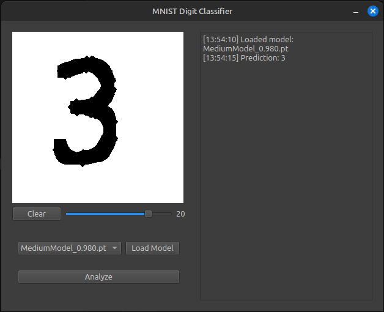

# MNIST UI
## Overview
- Based on the Dataset found here: https://www.kaggle.com/datasets/hojjatk/mnist-dataset
- UI for MNIST Digit Database, you draw a digit, it should properly classify it.
- A Picture of the UI can be found below.
<p align="center">
    
</p>

## Model
- Model can be currently found in "models/", with the code found in "code/architectures.py"
- Current Model provided contains 688,328 Trainable Parameters, which is a bit overkill. However, it is still very runnable on a CPU. Previous models that were trained contained ~10,000 Parameters at a 92.5% accuracy, but I went with this one instead.
- Below is training results for 600k Parameter Model.
```
## ARGUMENTS ##
epochs: 100
batch_size: 256
learning_rate: 0.001
val_split: 0.2
train_split: 0.6
shuffle: True
network_name: MediumModel
____________________________________________
|    EPOCH     |    LOSS    |   ACCURACY   |
|  0005/0100   |   0.0005   |    0.9581    |
|  0010/0100   |   0.0004   |    0.9694    |
|  0015/0100   |   0.0004   |    0.9711    |
|  0020/0100   |   0.0004   |    0.9747    |
|  0025/0100   |   0.0004   |    0.9744    |
|  0030/0100   |   0.0004   |    0.9780    |
|  0035/0100   |   0.0004   |    0.9773    |
|  0040/0100   |   0.0004   |    0.9754    |
|  0045/0100   |   0.0004   |    0.9772    |
|  0050/0100   |   0.0003   |    0.9787    |
|  0055/0100   |   0.0004   |    0.9779    |
|  0060/0100   |   0.0004   |    0.9789    |
|  0065/0100   |   0.0004   |    0.9776    |
|  0070/0100   |   0.0004   |    0.9787    |
|  0075/0100   |   0.0004   |    0.9779    |
|  0080/0100   |   0.0004   |    0.9786    |
|  0085/0100   |   0.0004   |    0.9786    |
|  0090/0100   |   0.0004   |    0.9796    |
|  0095/0100   |   0.0004   |    0.9801    |
|  0100/0100   |   0.0004   |    0.9774    |
--------------------------------------------
Test Loss: 0.000, Test Accuracy: 0.980
```

## Current Errors
- Specific Values are seen as incorrect. For example, a thinner and elongated 4 can be incorrectly classified as a "1".

## Changes for Future
- Cleaner UI. Currently functions properly, but is not as nice as I would like it to be.
- Give the user the ability to fine-tune the hyperparameters of a model by confirming whether or not the guess of the model was correct.
- Look into different & more complex models, including utilizing known architectures, such as ResNet.